# data文件夹

## data generation文件夹

### system_prompt_gpt4_0613.txt

&emsp;&emsp;指导 GPT-4 生成复杂指令的系统提示文件，主要用yu数据生成流程，帮助生成与 3D 对象相关的详细描述和问答对话。具体来说，文件要求模型执行以下任务：

1.生成详细描述：从给定的 3D 对象模型描述中，生成一段 50 至 100 个单词的详细说明，描述对象的类型、外观、功能及其在日常生活中的应用，但排除不确定的细节。

2.单轮问答生成：基于生成的描述，生成三个单轮问答对话，每个问答关注对象的不同方面。

3.多轮问答生成：构造一组包含三轮问答的对话，要求问答之间逻辑相关且内容不同于单轮问答部分。

## modelnet_config文件夹

### modelnet40_shape_names_modified.txt

&emsp;&emsp;包含 ModelNet40 数据集中所有对象的名称，用于在训练过程中生成对象名称的描述。

### ModelNet40.yaml

&emsp;&emsp;配置文件，定义了 ModelNet40 数据集的参数，包括数据路径、对象名称文件路径、训练集和测试集的划分等。

## modelnet.py

  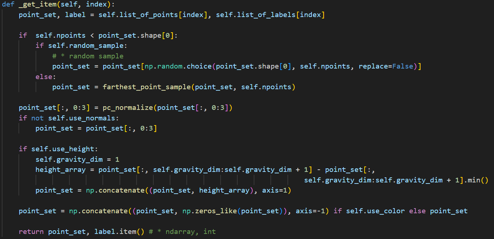

根据索引加载单个数据样本，并对其做预处理。

  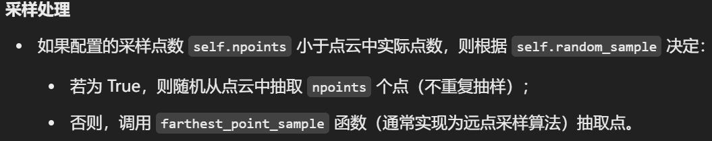

  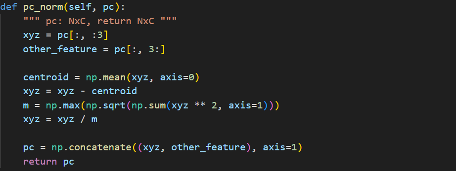

对输入点云进行归一化，确保其中心化并缩放到单位范围内。

  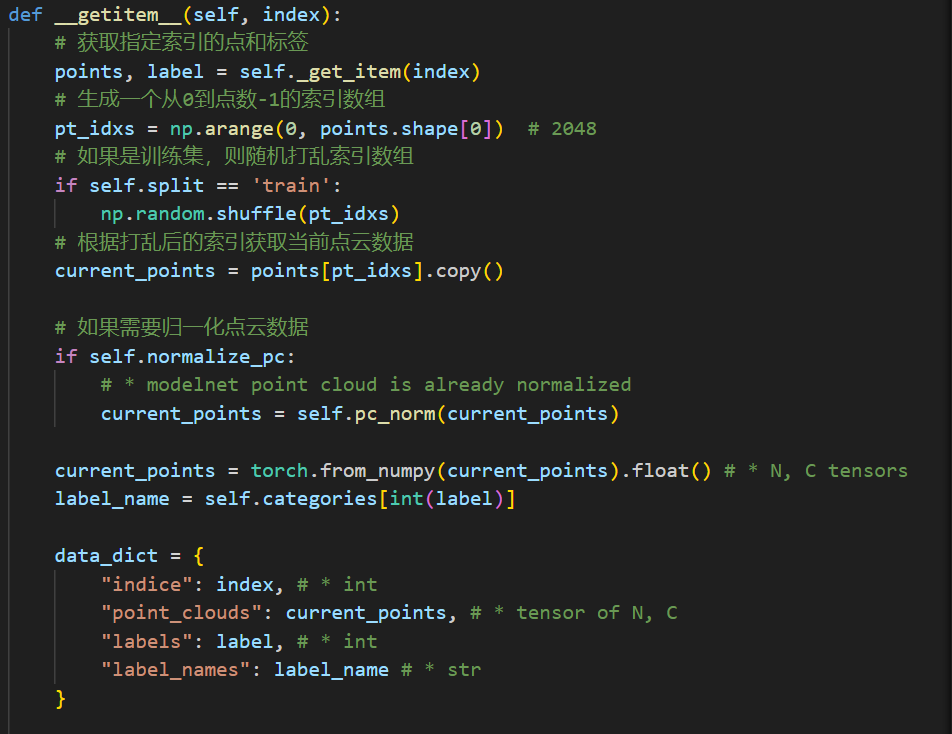

从数据集中取出一个样本，并将其转换为 PyTorch tensor，同时构造包含额外信息的字典返回。

## object_point_dataset.py

整个代码整体功能是构建一个点云和文本数据集，并为模型训练提供数据支持。

  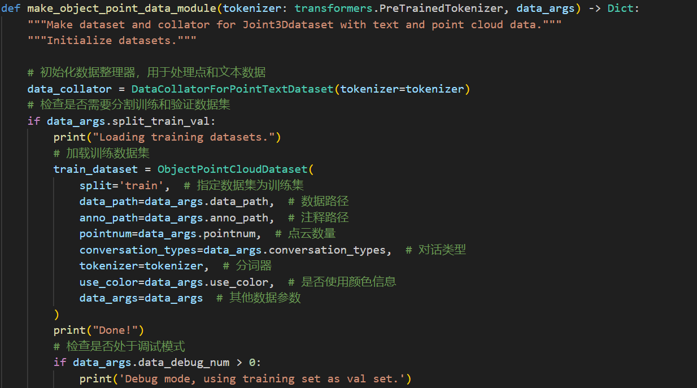

创建数据集和数据整理器（collator），用于训练和验证。

  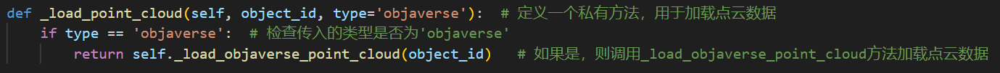

根据 object_id 加载对应的点云数据。

  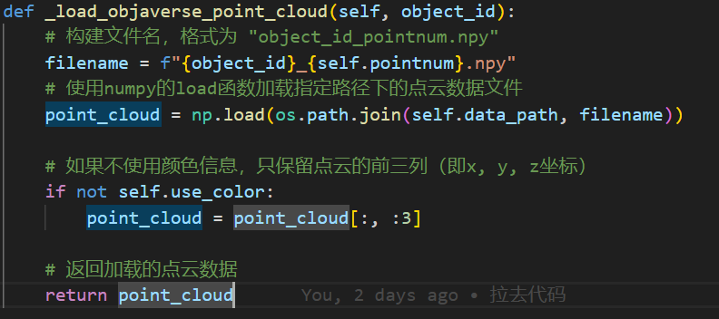

加载并返回 object_id 对应的点云数据。

## utils.py

定义一系列工具函数

  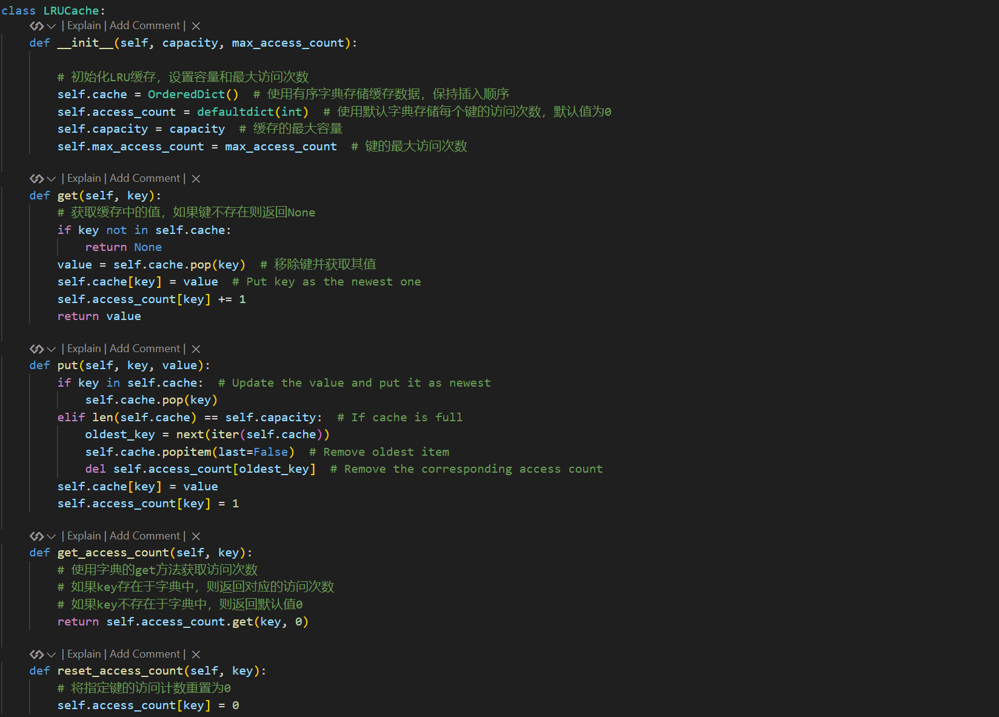

LRU缓存类，定义一些列缓存操作。

  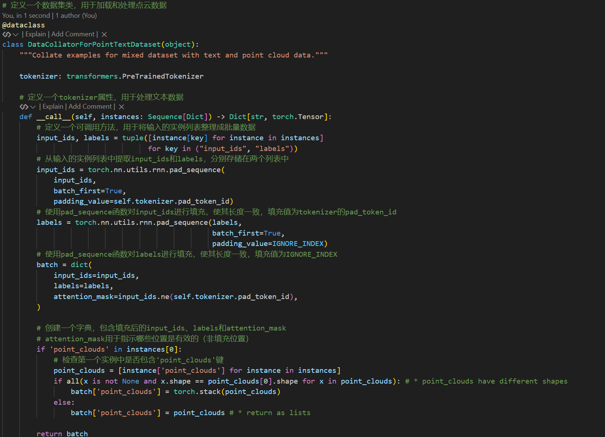

定义一个数据集类，用于加载和处理点云数据。

  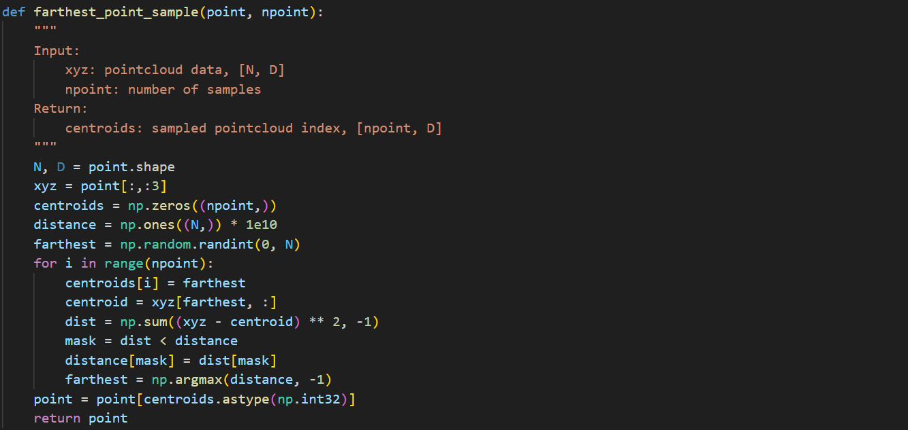

定义一个采样方法，从原始点云中采样，保持了数据的代表性，用于三维点云数据的降维处理。

  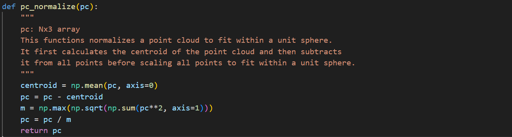

将点云数据标准化，使其适应单位球体。具体来说，它首先计算点云的质心，然后从所有点中减去这个质心，最后将所有点按比例缩放到单位球体内部。

# eval文件夹

## chat_gradio.py

  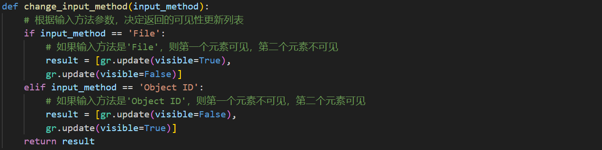

根据输入方法的参数来更新可见性设置。具体来说，它根据传入的 input_method 参数，返回一个包含两个元素的列表，每个元素都是一个 gr.update 对象，用于控制某个组件的可见性。

  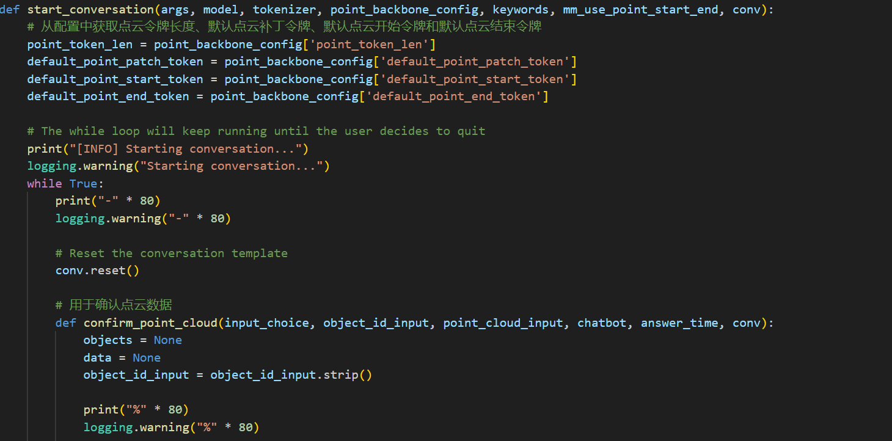

主函数，用于启动对话系统。它接收多个参数，包括命令行参数、模型、分词器、点云配置、关键词、是否使用点云开始和结束标记以及对话模板。

  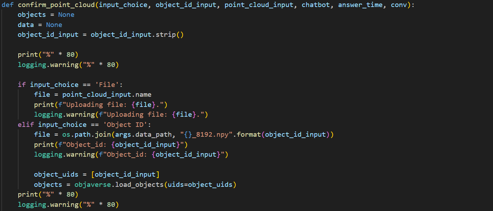

用于生成回答。它接收对话历史、回答时间、点云数据和对话模板作为输入。如果点云数据为空，它会提示用户输入点云。否则，它会使用模型生成回答，并将其添加到对话历史中。

  

用于确认点云数据。它处理用户输入，可以是文件上传或对象ID输入。根据输入类型，它会加载点云数据并进行预处理。如果处理成功，它会返回一个图形对象、点云数据、更新后的对话模板和回答时间。

  

用于启动对话系统。它接收多个参数，包括命令行参数、模型、分词器、点云配置、关键词、是否使用点云开始和结束标记以及对话模板。

## eval_modelnet_cls.py

  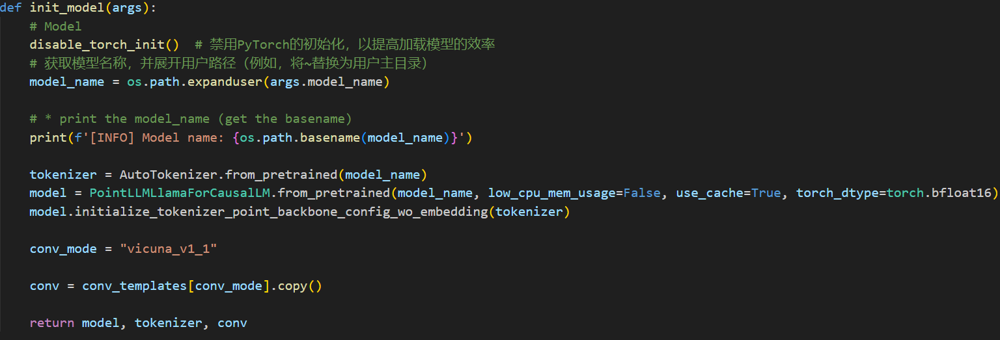

初始化机器学习模型。

  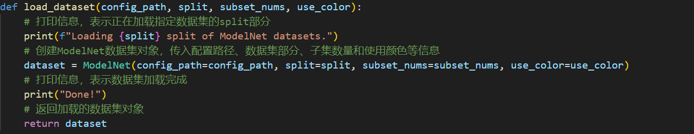

用于加载ModelNet数据集的指定部分。

  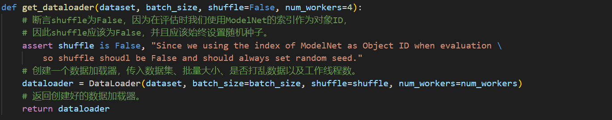

用于创建并返回一个数据加载器（DataLoader）。数据加载器是深度学习中用于批量加载数据、打乱数据以及多线程数据预处理的工具。

  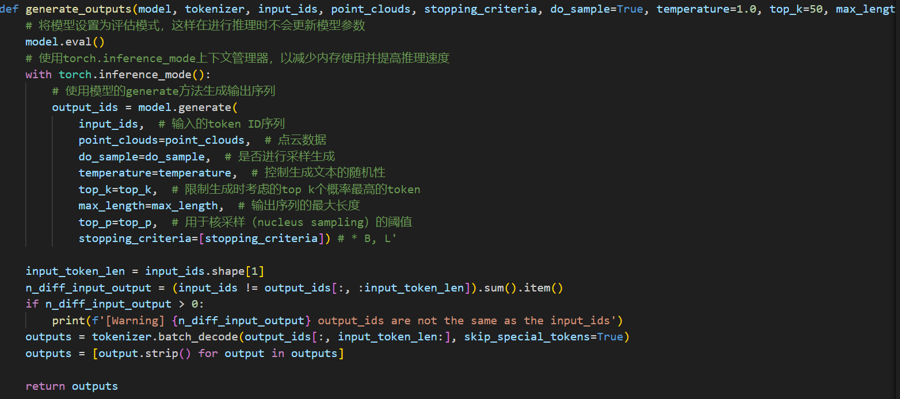

用于基于给定的输入和模型生成相应的输出序列。

  

用于生成模型响应并将其保存到指定的输出目录中。

## eval_objaverse.py

使用的是 Objaverse 数据集，这是一个大规模的3D对象数据集，包含了多样化的3D对象。可以用于对象描述生成（captioning）和分类任务，具体任务类型由参数 task_type 决定。

  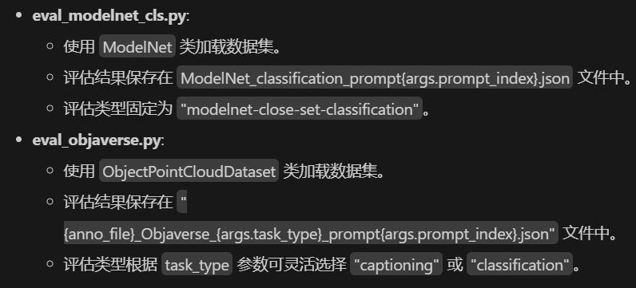

## evaluator.py

