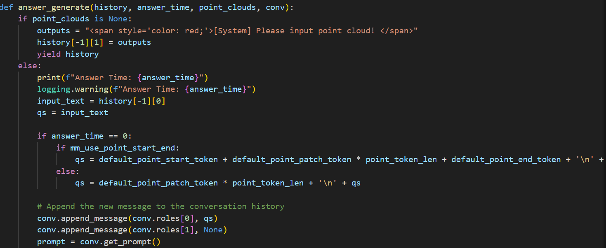
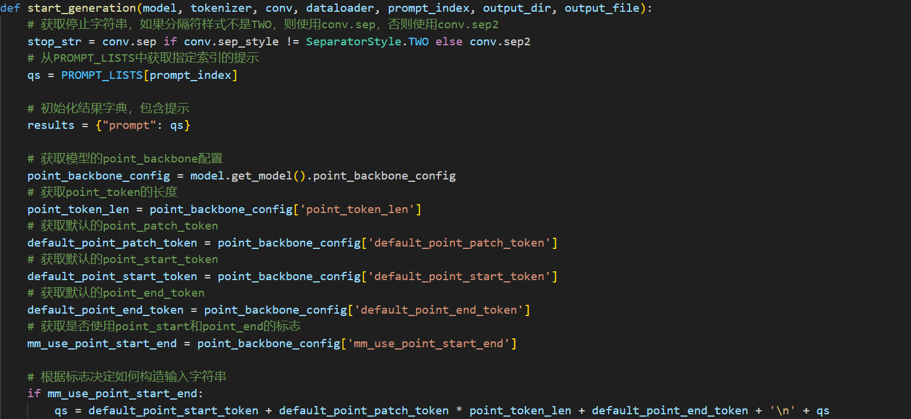
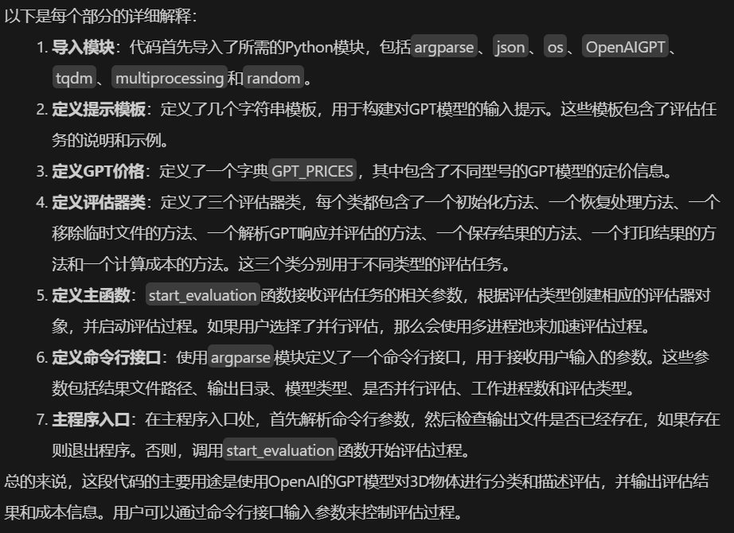

# data文件夹

## data generation文件夹

### system_prompt_gpt4_0613.txt

&emsp;&emsp;指导 GPT-4 生成复杂指令的系统提示文件，主要用yu数据生成流程，帮助生成与 3D 对象相关的详细描述和问答对话。具体来说，文件要求模型执行以下任务：

1.生成详细描述：从给定的 3D 对象模型描述中，生成一段 50 至 100 个单词的详细说明，描述对象的类型、外观、功能及其在日常生活中的应用，但排除不确定的细节。

2.单轮问答生成：基于生成的描述，生成三个单轮问答对话，每个问答关注对象的不同方面。

3.多轮问答生成：构造一组包含三轮问答的对话，要求问答之间逻辑相关且内容不同于单轮问答部分。

## modelnet_config文件夹

### modelnet40_shape_names_modified.txt

&emsp;&emsp;包含 ModelNet40 数据集中所有对象的名称，用于在训练过程中生成对象名称的描述。

### ModelNet40.yaml

&emsp;&emsp;配置文件，定义了 ModelNet40 数据集的参数，包括数据路径、对象名称文件路径、训练集和测试集的划分等。

## modelnet.py

  

根据索引加载单个数据样本，并对其做预处理。

  

  

对输入点云进行归一化，确保其中心化并缩放到单位范围内。

  

从数据集中取出一个样本，并将其转换为 PyTorch tensor，同时构造包含额外信息的字典返回。

## object_point_dataset.py

整个代码整体功能是构建一个点云和文本数据集，并为模型训练提供数据支持。

  

创建数据集和数据整理器（collator），用于训练和验证。

  

根据 object_id 加载对应的点云数据。

  

加载并返回 object_id 对应的点云数据。

## utils.py

定义一系列工具函数

  

LRU缓存类，定义一些列缓存操作。

  

定义一个数据集类，用于加载和处理点云数据。

  

定义一个采样方法，从原始点云中采样，保持了数据的代表性，用于三维点云数据的降维处理。

  

将点云数据标准化，使其适应单位球体。具体来说，它首先计算点云的质心，然后从所有点中减去这个质心，最后将所有点按比例缩放到单位球体内部。

# eval文件夹

## chat_gradio.py

  

根据输入方法的参数来更新可见性设置。具体来说，它根据传入的 input_method 参数，返回一个包含两个元素的列表，每个元素都是一个 gr.update 对象，用于控制某个组件的可见性。

  

主函数，用于启动对话系统。它接收多个参数，包括命令行参数、模型、分词器、点云配置、关键词、是否使用点云开始和结束标记以及对话模板。

  

用于生成回答。它接收对话历史、回答时间、点云数据和对话模板作为输入。如果点云数据为空，它会提示用户输入点云。否则，它会使用模型生成回答，并将其添加到对话历史中。

  

用于确认点云数据。它处理用户输入，可以是文件上传或对象ID输入。根据输入类型，它会加载点云数据并进行预处理。如果处理成功，它会返回一个图形对象、点云数据、更新后的对话模板和回答时间。

  

用于启动对话系统。它接收多个参数，包括命令行参数、模型、分词器、点云配置、关键词、是否使用点云开始和结束标记以及对话模板。

## eval_modelnet_cls.py

  

初始化机器学习模型。

  

用于加载ModelNet数据集的指定部分。

  

用于创建并返回一个数据加载器（DataLoader）。数据加载器是深度学习中用于批量加载数据、打乱数据以及多线程数据预处理的工具。

  

用于基于给定的输入和模型生成相应的输出序列。

  

用于生成模型响应并将其保存到指定的输出目录中。

## eval_objaverse.py

使用的是 Objaverse 数据集，这是一个大规模的3D对象数据集，包含了多样化的3D对象。可以用于对象描述生成（captioning）和分类任务，具体任务类型由参数 task_type 决定。

  

## evaluator.py

用于使用OpenAI的GPT模型对3D物体进行分类和描述评估。代码中定义了三个主要的评估器类：OpenAIOpenFreeFormClsEvaluator、OpenAICloseSetClsEvaluator和OpenAIObjectCaptioningEvaluator，分别用于开放形式的分类、封闭集的分类和物体描述的评估。此外，还有一个主函数start_evaluation用于启动评估过程，以及一个命令行接口用于接收用户输入的参数。

  

## PointLLM_chat.py

于点云数据和语言模型的对话系统。它使用了一个预训练的语言模型（PointLLM），并结合点云数据进行交互式对话。

  

通过object_id从指定路径加载点云数据，并将其转换为PyTorch张量。

## traditional_evaluator.py

定义了一个名为 TraditionalMetricEvaluator 的类，用于评估自然语言处理模型生成的文本的质量。该类主要使用多种传统的评估指标，如 BLEU、ROUGE、METEOR，以及基于句向量的相似度评估方法（如 SBERT 和 SimCSE）。

用于评估自然语言处理模型输出的函数。它计算了多种评估指标，包括BLEU、ROUGE、METEOR、SBERT相似度和SimCSE相似度。

## utils.py

实现带有指数退避策略的重试机制。指数退避是一种错误处理策略，通常用于网络编程中，当遇到暂时性错误时，通过逐渐增加重试间隔来减少对服务器的压力。

用于与 OpenAI 的 GPT-3.5-turbo 模型进行交互。

# model文件夹

## pointbert文件夹

### checkpoint.py

这段代码主要涉及深度学习模型参数的管理和检查点（checkpoint）的处理。下面是对每个函数的详细解释：

1.get_missing_parameters_message(keys: List[str]) -> str:

用途: 生成一个日志友好的消息，报告在模型中存在但在检查点中找不到的参数名称。
实现原理: 使用 _group_checkpoint_keys 函数对参数名称进行分组，然后格式化成蓝色文本的消息。
参数: keys 是一个字符串列表，表示在检查点中找不到的参数名称。
返回值: 一个字符串消息。

2.get_unexpected_parameters_message(keys: List[str]) -> str:

用途: 生成一个日志友好的消息，报告在检查点中存在但在模型中找不到的参数名称。
实现原理: 与 get_missing_parameters_message 类似，但生成的是紫色文本的消息。
参数: keys 是一个字符串列表，表示在模型中找不到的参数名称。
返回值: 一个字符串消息。

3._strip_prefix_if_present(state_dict: Dict[str, Any], prefix: str) -> None:

用途: 如果存在前缀，则从状态字典中去除该前缀。
实现原理: 检查状态字典中的所有键是否以指定前缀开头，如果是，则去除前缀。
参数: state_dict 是一个有序字典，表示要加载到模型中的状态字典；prefix 是要去除的前缀。
返回值: 无返回值，直接修改 state_dict。

4._group_checkpoint_keys(keys: List[str]) -> Dict[str, List[str]]:

用途: 根据公共前缀对键进行分组。
实现原理: 遍历键列表，根据最后一个 . 之前的部分作为前缀进行分组。
参数: keys 是一个字符串列表，表示模型检查点字典中的参数名称。
返回值: 一个字典，键是前缀，值是具有相同前缀的参数名称列表。

5._group_to_str(group: List[str]) -> str:

用途: 将参数名称后缀组格式化为可记录的字符串。
实现原理: 根据后缀组的长度，生成不同的格式化字符串。
参数: group 是一个字符串列表，表示参数名称的后缀。
返回值: 一个格式化的字符串。

6._named_modules_with_dup(model: nn.Module, prefix: str = "") -> Iterable[Tuple[str, nn.Module]]:

用途: 与 model.named_modules() 类似，但包括具有多个名称的重复模块。
实现原理: 递归地遍历模型的所有模块，并生成模块的名称和模块本身。
参数: model 是一个 nn.Module 对象，表示要遍历的模型；prefix 是模块名称的前缀。
返回值: 一个生成器，生成 (名称, 模块) 的元组。

### dvae.py

构建一个神经网络模型。这个模型主要用于处理一维和二维的卷积操作，并通过一系列的层来转换输入特征。

用于获取图特征（Graph Feature）的函数，通常用于点云处理或图形学中的局部特征提取。

用于在一个点云数据中，为每个查询点（new_xyz）寻找其对应的 nsample 个最近邻点。具体来说，它先计算查询点与所有点（xyz）之间的平方距离，然后利用 torch.topk 在最后一个维度上选取距离最小的 nsample 个点的索引，返回这些索引以便后续进行局部特征提取或其他操作。

计算两个点云之间的欧氏距离的平方。

将输入的点云数据分组，并对每组内的点进行归一化处理。

对点云的局部组（point_groups）进行编码，生成全局特征。输入的点组尺寸为 [B, G, N, 3]，其中 B 是批次大小，G 表示局部组的数量，N 为每个组中的点数，3 表示点的维度（x, y, z）。

此 Decoder 类接收全局特征，经过多层 MLP 生成粗略点云（coarse），再借助折叠操作（folding operation）生成细化点云（fine）。

基于离散 VAE 的点云生成模型。
将输入点云分组，再对每个局部组提取全局特征（通过 Encoder）。
利用第一个 DGCNN 将 Encoder 的输出映射到离散 tokens 的 logits，然后通过 Gumbel-Softmax 得到近似 one-hot 分布，再用 codebook 将离散 tokens 映射到连续特征表示。
利用第二个 DGCNN 对离散特征进一步处理，供 Decoder 使用。
通过 Decoder 利用处理后的全局特征生成粗略（coarse）和细化（fine）的点云。
在 forward 函数中，输出整体点云（加回中心点信息）以及中间结果（例如 tokens logits），供后续计算重构损失和 KL 散度使用。